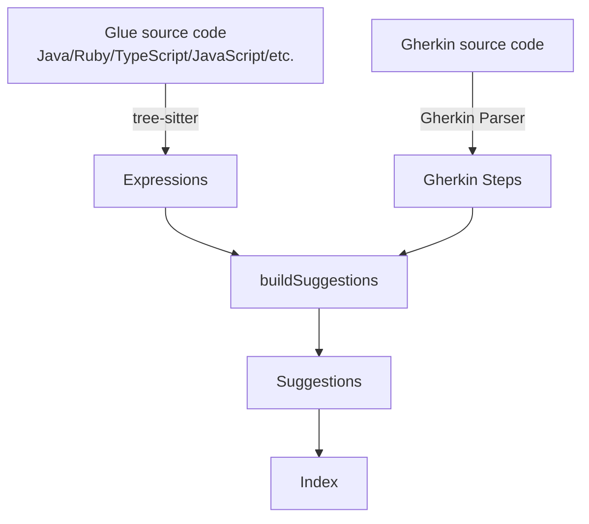

# Architecture

The Cucumber Language Service library has two APIs:

- **Extraction API**
- **Language Service API**, which is used by [Cucumber Language Server](https://github.com/cucumber/language-server/#readme)
  and [Cucumber Monaco](https://github.com/cucumber/monaco/#readme)

The Extraction API provides data structures that are passed as input to the Language Service API.

## Extraction API

The Extraction API is used to extract information from Gherkin Documents and Step Definitions. It generates data structures
that are consumed by the Language Service API.

[Cucumber Expressions](https://github.com/cucumber/cucumber-expressions/#readme) and Regular Expressions are extracted
from Java/Ruby/TypeScript/JavaScript/etc. source code using [tree-sitter](https://tree-sitter.github.io/tree-sitter/).

Gherkin steps are extracted from Gherkin source code using the Gherkin parser.

Expressions and steps are passed to `buildSuggestions` to produce an array of `Suggestion`, and these are used to update
a (search) `Index`.

## Language Service API

The Language Service API provides [LSP](https://microsoft.github.io/language-server-protocol/) services.

The _expressions_ and _index_ objects are used in the various `getXxx` functions that provide the
"editor" API. This API is used by both [Cucumber Language Server](https://github.com/cucumber/language-server/#readme)
and [Cucumber Monaco](https://github.com/cucumber/monaco/#readme).
